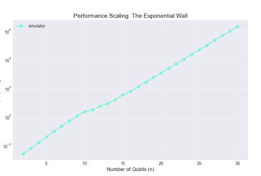

# Quantum Simulator C++

A high-performance quantum circuit simulator written in C++ that utilizes the Eigen library for state-vector manipulation and OpenMP for parallel acceleration. The project includes a Python-based visualization suite to analyze quantum states and performance metrics.

## Features

* **Efficient State-Vector Simulation**: Contiguous memory allocation for $2^n$ complex amplitudes using Eigen.
* **Gate Library**: Supports standard gates such as Hadamard, Pauli-X, Pauli-Z, CNOT, and Toffoli.
* **Parametric Rotations**: Includes implementation for $Rx$, $Ry$, $Rz$, and PhaseShift operations.
* **Parallel Computing**: Multi-threaded gate application via OpenMP to optimize performance during state manipulation.
* **Measurement**: Support for qubit measurement which collapses the state vector based on calculated probabilities.
* **State Visualization**:
  * **Bloch Sphere**: Projections for individual qubits in systems with 3 or fewer qubits using QuTiP.
  * **Probability Histograms**: Distribution plots for systems with more than 3 qubits.
* **Benchmarking**: Automated scripts to measure execution time scaling up to 30 qubits.

## Project Structure

* **src/**: C++ source files including `QubitRegister.cpp`, `main.cpp`, and `bench.cpp`.
* **include/**: Header files defining the simulator interface, specifically `QubitRegister.hpp`.
* **scripts/**: Python tools for visualization including `quantum_viz.py` and `benchmark_viz.py`.
* **build/**: Directory for compiled binaries and exported results in JSON or CSV format.

## Prerequisites

### C++ Dependencies

* **Compiler**: A C++17 compatible compiler (GCC or Clang) with **OpenMP** support.
* **Eigen Library**: Required for linear algebra operations and state vector storage.

### Python Dependencies

The visualization scripts require Python 3 and the dependencies listed in `requirements.txt`. Install them via:

```bash
pip install -r requirements.txt
```

### Performance Analysis: The Exponential Wall

The following benchmark represents the execution time for applying a Hadamard gate to every qubit in the register. Tests were conducted on a machine with OpenMP parallelization enabled.

| Qubits (n) | Time (ms) | Time (Approx) |
|------------|-----------|---------------|
| 10         | 2.42      | < 0.01 sec    |
| 20         | 1,209     | ~ 1.2 sec     |
| 25         | 49,385    | ~ 49 sec      |
| 30         | 2,140,400 | ~ 35 min      |



### Observations

As shown in the data, the simulation time doubles with each additional qubit ($T \propto 2^n$). This highlights the computational limits of classical hardware when simulating quantum systems. For $n=30$, the state vector requires approximately **16 GB of RAM** (assuming 128-bit complex doubles).

### Compilation and Build System

The project uses CMake to manage the build process, locate the Eigen library, and configure OpenMP support.

### Running the simulator

Run the main executable to perform a quantum circuit simulation and export the state to JSON:

```bash
./quantum_simulator
```
The simulation data is saved as simulation_result.json.
Run the Python visualizer to generate Bloch spheres or probability charts:

```bash
python ../scripts/quantum_viz.py
```
Execute the benchmark tool to record execution times for registers up to 30 qubits, then plot the scaling:

```bash
./benchmark
python ../scripts/benchmark_viz.py
```
TODO Cuda implementation