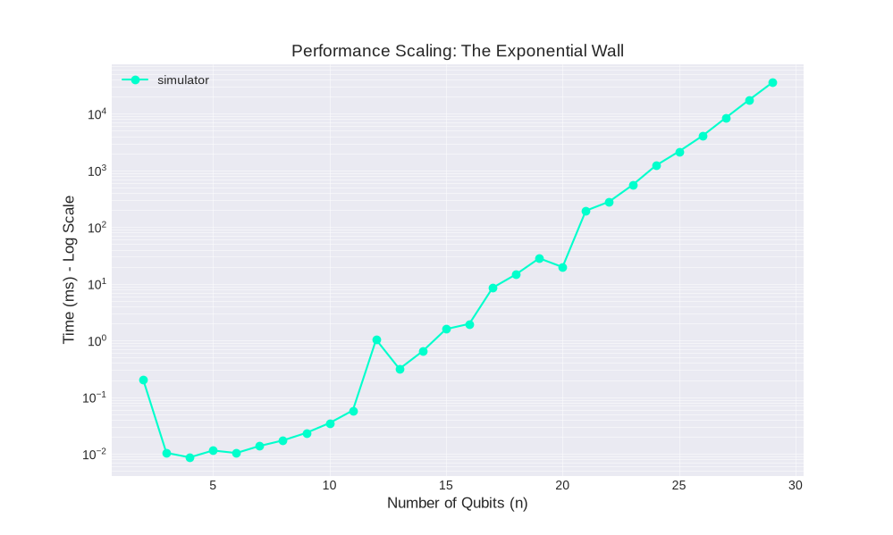

This project has as its sole aim that of learning and personal improvement.
# Quantum Simulator C++

A high-performance quantum circuit simulator written in C++. The simulator stores the quantum state as a dense state vector using a Structure of Arrays (SoA) layout: one contiguous vector for real components and one contiguous vector for imaginary components. Eigen is used for small gate matrices, while the state-vector kernels are implemented directly for better memory access control. The project also includes a Python-based visualization suite to analyze quantum states and performance metrics.

## Features

* **Efficient State-Vector Simulation**: Contiguous memory allocation for $2^n$ amplitudes using separate real and imaginary arrays.
* **Gate Library**: Supports standard gates such as Hadamard, Pauli-X, Pauli-Z, CNOT, and Toffoli.
* **Parametric Rotations**: Includes implementation for $Rx$, $Ry$, $Rz$, and PhaseShift operations.
* **Optimized Single-Qubit Gates**: Applies gates by updating amplitude pairs, with a tiled implementation for better cache locality on larger registers.
* **Parallel Computing**: Gate kernels are written with OpenMP pragmas and can be compiled with OpenMP support for multi-threaded execution.
* **Measurement**: Support for qubit measurement which collapses the state vector based on calculated probabilities.
* **State Visualization**:
  * **Bloch Sphere**: Projections for individual qubits in systems with 3 or fewer qubits using QuTiP.
  * **Probability Histograms**: Distribution plots for systems with more than 3 qubits.
* **Benchmarking**: Automated benchmark executable and plotting script to measure exponential scaling.

## Project Structure

* **src/**: C++ source files including `QubitRegister.cpp`.
* **include/**: Header files defining the simulator interface, specifically `QubitRegister.hpp`.
* **benchmarks/**: C++ benchmark source.
* **tests/**: C++ validation programs for gates and GHZ-state generation.
* **visualizer/**: Python tools for visualization including `quantum_viz.py` and `benchmark_viz.py`.


## Prerequisites

### C++ Dependencies

* **Compiler**: A C++17 compatible compiler (GCC or Clang) with **OpenMP** support.
* **Eigen Library**: Required for linear algebra operations and state vector storage.

### Python Dependencies

The visualization scripts require Python 3 and the dependencies listed in `requirements.txt`. Install them via:

```bash
pip install -r requirements.txt
```

### Performance Analysis: The Exponential Wall

The benchmark applies a Hadamard gate to every qubit in the register. Because this is a dense state-vector simulator, both runtime and memory usage scale exponentially with the number of qubits. The latest benchmark was compiled in `Release` mode with OpenMP enabled.

| Qubits (n) | Time (ms) | Time (Approx) |
|------------|-----------|---------------|
| 10         | 0.0349    | < 0.01 sec    |
| 15         | 1.5868    | < 0.01 sec    |
| 20         | 19.7274   | ~ 0.02 sec    |
| 21         | 194.565   | ~ 0.19 sec    |
| 22         | 281.099   | ~ 0.28 sec    |
| 23         | 551.388   | ~ 0.55 sec    |
| 24         | 1,215.23  | ~ 1.22 sec    |
| 25         | 2,165.51  | ~ 2.17 sec    |
| 26         | 4,056.58  | ~ 4.06 sec    |
| 27         | 8,446.12  | ~ 8.45 sec    |
| 28         | 17,468.7  | ~ 17.47 sec   |
| 29         | 35,403.7  | ~ 35.40 sec   |
| 30         | OOM       | requires ~16 GiB for the state vector alone |



#### Latest `perf stat` Summary

```text
2,059,631,302,263 cycles
619,153,038,389 instructions
33,630,164,388 cache-references
2,721,285,496 cache-misses
82.934665866 seconds elapsed
674.453235000 seconds user
13.834025000 seconds sys
```

The measured cache-miss rate is about 8.09% (`cache-misses / cache-references`). This is higher than in the older single-threaded/non-OpenMP build, but the wall-clock time is much lower. With OpenMP enabled, multiple threads process different parts of the state vector at the same time, increasing pressure on caches and memory bandwidth while reducing elapsed time. The large gap between elapsed time and user time confirms parallel execution.

#### Historical Comparison

The current implementation uses:

* **SoA layout**: `stateReal[]` and `stateImag[]`
* **Tiled single-qubit gate application**
* **Manual real/imag arithmetic in the hot loop**

An older implementation used:

* **AoS layout**: one vector of `std::complex<double>` / `Eigen::VectorXcd`
* **Non-tiled gate loops**


### Observations

As shown in the data, simulation cost grows exponentially with the number of qubits. The current SoA layout stores two `double` arrays, so the raw state-vector memory is:

```text
memory = 2^n * 2 * sizeof(double)
```

This means that 29 qubits require about **8 GiB** for the state vector alone, while 30 qubits require about **16 GiB** before accounting for allocator overhead, OpenMP runtime, the operating system, and other active processes. On the tested machine, the 30-qubit run was terminated due to excessive memory usage, which marks the practical local memory limit for this dense simulator.

### Compilation and Build System

The project uses CMake to manage the build process, locate the Eigen library, and configure OpenMP support.

```bash
cmake -S . -B build -DCMAKE_BUILD_TYPE=Release
cmake --build build
```

### Running the simulator

Run the main executable to perform a quantum circuit simulation and export the state to JSON:

```bash
./build/quantum_simulator
```
The simulation data is saved as simulation_result.json.
Run the Python visualizer to generate Bloch spheres or probability charts:

```bash
python visualizer/quantum_viz.py
```
Execute the benchmark tool to record execution times, then plot the scaling:

```bash
./build/quantum_benchmark
python visualizer/benchmark_viz.py
```
